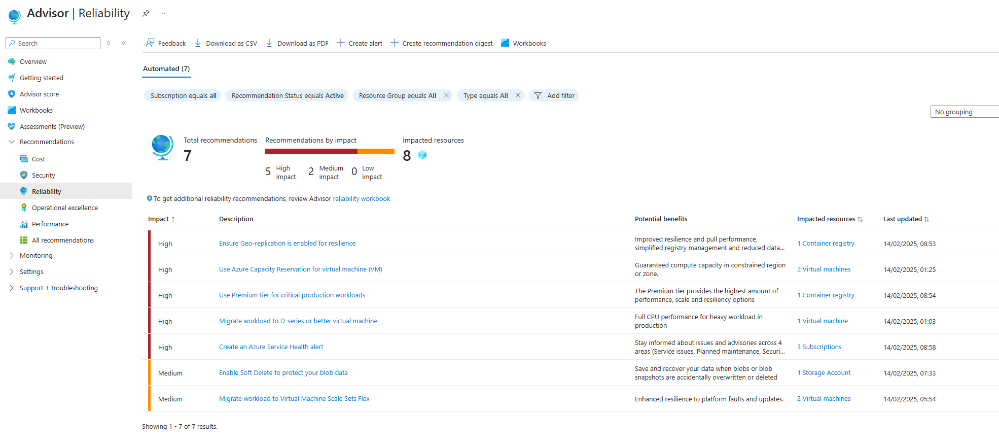

# Adoption Strategy for Well Architected Framework (WAF) Reliability (Sample)

Sample Adoption Strategy for Well Architected Framework (WAF) Reliability Pillar.  

## Content

- [Document Audience](#document-audience)
- [Introduction](#introduction)
- [Scope](#scope)
- [Strategy Objectives and KPIs](#strategy-objectives-and-kpis)
- [Key Strategy Principles](#key-strategy-principles)
- [Current (WAF Adoption) State](#current-waf-adoption-state)
- [WAF Adoption Solution Options (Target State)](#waf-adoption-solution-options-target-state)
- [Roles and Responsibilities](#roles-and-responsibilities)
- [Strategy and Delivery Dependencies](#strategy-and-delivery-dependencies)
- [Adoption (Transition) Plan (Strategic Initiatives)](#adoption-transition-plan-strategic-initiatives)

## Executive Summary

The Azure Well-Architected Framework (WAF) Adoption Strategy for Reliability Pillar, focuses on embedding best practices for reliability into cloud solutions. The strategy's core principle is to prioritize "codified" guidance leveraging code and automation—over written guidance documents. This ensures that best practices are actionable, repeatable, and scalable.

Key principles include:

- Automation over documentation: Codify WAF best practices into tools like Azure Advisor, Azure Policy, and Azure Verified Modules (AVM).
- Repeatability: Use reusable, automated solutions instead of bespoke approaches.
- Incremental delivery: Implement WAF adoption in small, iterative steps.
- Advisory approach: Provide guidance to teams rather than enforcing compliance.

The strategy integrates WAF principles into CI/CD pipelines, Azure tools, and DevOps practices, enabling teams to improve service quality without compromising delivery speed. By adopting this approach, the organization ensures consistent, measurable improvements in cloud infrastructure resilience, security, and efficiency.

## Audience

| Audience                               | Role                                                                                           |
| -------------------------------------- | ---------------------------------------------------------------------------------------------- |
| WAF Adoption Strategy development team | The document captures key concepts and decisions as result of interactive v-team collaboration |
| Department Cloud Technology Leader(s)  | Documented strategy to be reviewed and approved by                                             |

## Introduction

The [Azure Well-Architected Framework (WAF)](https://learn.microsoft.com/azure/well-architected/) is a design framework that can improve the quality of a workload by helping it to:
- Be resilient, available, and recoverable.
- Be as secure as you need it to be.
- Deliver a sufficient return on investment.
- Support responsible development and operations.
- Accomplish its purpose within acceptable timeframes.
  
The framework is founded on the five pillars of architectural excellence, which are mapped to those goals. They are: [Reliability](https://learn.microsoft.com/azure/well-architected/reliability/), Security, Cost Optimization, Operational Excellence, and Performance Efficiency.

The WAF Adoption Strategy outlines the approach for adopting the WAF within an department or Business Unit. The purpose of this strategy is to ensure that our cloud solutions are designed, implemented, and operated in a manner that aligns with best practices for reliability, security, cost optimization, operational excellence, and performance efficiency.
This document serves as a guide for the WAF Adoption Strategy team and Department Cloud Technology Leaders, providing a structured approach to integrating WAF principles into our cloud solution design and operations. By following this strategy, we aim to improve the overall quality of our Azure services without compromising on delivery speed and agility.
The strategy includes detailed plans for leveraging Azure Advisor, Azure Policy Compliance, and other tools to achieve our objectives. It also outlines key adoption principles, roles and responsibilities, and a phased transition plan to ensure a smooth and effective implementation.
By adopting the Azure Well Architected Framework, we aim to enhance our cloud infrastructure's resilience, security, and efficiency, ultimately delivering better value to our stakeholders.

## Scope

The Azure WAF Adoption strategy incudes the following scope:

| Concern                                                                                | Scope                                    |
| -------------------------------------------------------------------------------------- | ---------------------------------------- |
| Azure WAF Pillars                                                                      | Reliability                              |
| Environment                                                                            | Azure Cloud                              |
| Service Types                                                                          | Infrastructure Service, Platform Service |
| [Service Quality Class](#system-quality-level-classification-and-waf-compliance-level) | Mission Critical                         |

## Objectives

### Parent Organizational or Department Objectives

TBD

### Objective - Improve Azure infrastructure and platform service quality

- Key Results
  - MTBF is reduced by 10% by end of Q4 2025
  - Measured Availability vs. Availability SLOs is improved by 10% by end of Q4 2025

### Objective - Improve the quality without negatively impacting a delivery velocity

- Key Results
  -  Code commit to production duration is not increased for more than 10% as result of meeting Objective 1 (by end of Q4 2025)
  -  Number of releases is not decreased for more than 10% as result of meeting Objective 1 (by end of Q4 2025)

## Key Principles

1. **Reuse (external or internal)** - instead of developing be spoke solutions and frameworks
2. **Automate when possible** - Prefer automation (codifying the process) over writing guidance documents with directions how to implement the WAF best practices
3. **Make it repeatable** - instead of once of (bespoke) approach for every solution / application
4. **Deliver in increments** - Leverage Lean/Agile concepts and deliver WAF adoption solutions in small increments (e.g. 2-3 weeks), with each increment providing the value
5. **Advise instead of enforce** - Purpose of this strategy is develop advised solution to help teams achieve their quality metrics rather than enforce proposed WAF Adoption solutions in any way.

## Current State (WAF Adoption) 

Application and Infrastructure teams are available of Azure WAF but there is no structured approach for the consistent and measurable adoption.
Some Microsoft [(WARA) - Well Architected Framework Reliability Assessments](#5-microsoft-waf-reliability-assessment-wara) were delivered in the organization. 

## Target State Solution 

There are multiple solutions that could be used to align implemented service with the WAF Reliability recommendations. 

### Summary of Delivery Practices

Following are the proposed DevOps / Continuous Delivery practices, processes and tools to be used to adopt Azure WAF

| Name                                                                                | Type     | WAF recommendations coverage                  | Complexity      | Impact |
| ----------------------------------------------------------------------------------- | -------- | --------------------------------------------- | --------------- | ------ |
| Automated Acceptance Testing Quality Gate (with Azure Proactive Resiliency Library) | Practice | Medium                                        | High            | Medium |
| Manual Acceptance Quality Testing Quality Gate                                      | Practice | Low                                           | Low             | High   |
| [Azure Policy](#azure-policy-)                                                      | Practice | Medium (or High with custom Policies)         | Medium          | High   |
| [Azure Verified Modules (AVM)](https://azure.github.io/Azure-Verified-Modules/)     | Practice | Low (currently, work in progress)             | Medium-High (1) | High   |
| Microsoft WAF Reliability Assessment (WARA)                                         | Service  | High                                          | Medium          | Medium |
| Documented Standards and Guidelines                                                 | Guidance | High (to cover gaps not covered by automation | High            | Medium |
| DevOps (CI/CD) pipelines                                                            | Practice | n/a                                           | Low             | High   |

(1) High in case custom modules or enhancements of incomplete modules is required

### System Quality Level Classification and WAF compliance level

Different services require varying levels of quality. The Microsoft WAF frameworks recommend classifying systems and mapping best practices to each application class. Not all recommendations are applicable to every application class.
For example, application classes could include: Mission Critical, Business Critical, and Supporting. A Mission Critical application might require all recommendations to be applied, while a Supporting application may only need a smaller subset.
Therefore, it is important to apply WAF adoption solutions with application classification in mind to avoid creating unrealistic quality expectations for less critical applications.

Please see following articles for more detailed information about system quality classification:
- [Azure Well Architected Framework - Assign a criticality rating to each flow](https://learn.microsoft.com/azure/well-architected/reliability/identify-flows#assign-a-criticality-rating-to-each-flow)
- [Azure Cloud Adoption Framework - Criticality scale](https://learn.microsoft.com/en-us/azure/cloud-adoption-framework/manage/considerations/criticality#criticality-scale)

### Practices Overview

#### 1) Azure Advisor

[Azure Advisor for reliability](https://urldobd.org) is a feature within Azure Advisor that provides recommendations to help you improve the reliability of your Azure resources.
Reliability in this context refers to the ability of a system to recover from failures and continue to function.
Azure Advisor analyzes your resource configurations and usage telemetry and then provides best practices and recommendations to enhance the reliability of your applications and services.

##### Assumptions and Constraints
- Only subset of WAF recommendations is covered with current Azure Advisor (Portal) capability (i.e. 30%?), therefore Advisor alone would not be sufficient to provide high level of WAF best practices coverage.
- Certain WAF recommendations will never be available within the Azure Advisor given that some of the recommendations are design and process recommendation, therefore not suitable for tool based assessment of deployed Azure resources.

##### Solution 

- Azure Advisor should be integrated within Service design and delivery lifecycle.
  - Ideally, to be implemented as a CI/CD quality gate for the service which fails in case Advisor % of recommendations are not met
  - Application should not be deployed to production without achieving expected percentage of compliance

This quality gate could be implemented as a Task in the pipeline or as a manual validation expected from the team.

#### 2) Azure Policy

[Azure Policy](https://urltbd.org) is an Azure service that provides creation, assigning and managing of policies to enforce organizational standards and assess compliance at scale.

There is number of our of box polices aimed to check reliability related configuration of Azure Services. Custom Policies can be also written with the same goal.
The WAF recommendations which are not covered by Azure Advisor could be covered by deploying out of box Azure Policies covering WAF Reliability recommendations. Consider writing custom Policies in case other proposed Azure WAF adoption Solutions are not applicable.

##### Solution 

- Azure WAF related policies are using Audit effect (not preventing deployment of resources)
- Deployed Azure resources are evaluated by the Policy and Policy compliance report is generated
- CI/CD pipeline uses Policy compliance (e.g. over subscription if subscription is scoped to the Application) as a quality check and gate
- One of the approaches for mapping the Application Class with a WAF Quality Class and associated Policies is use of Azure Management Groups or Tags to group/tag Application resources to a corresponding class.
  - Example: Mission Critical app is deployed to "Mission Critical" Management Group (or subscription with such Tag) which has "WAF Mission Critical" Policy Initiative assigned.

#### 3) Azure Verified Modules (AVM)

[Azure Verified Modules (AVM)](http://urltbd.org) are pre-built, reusable infrastructure as code (IaC) modules that have been verified by Microsoft to meet best practices for security, reliability, and operational excellence.
These modules are designed to simplify the deployment and management of Azure resources by providing standardized, tested, and validated templates that can be easily integrated into your infrastructure.

##### Solution 

- Use AVMs to deploy Azure Resources and apply WAF Reliability configuration 

#### 4) Documented Guidance and Standards

Document any WAF best practices not covered by other "automated" solutions as a Guidance or Internal Standard document.

#### 5) Microsoft WAF Reliability Assessment (WARA)

The Microsoft Well Architected Framework (WAF) Reliability Assessment (WARA) is a structured engagement provided by Microsoft as a professional service, designed to help organizations evaluate and improve the reliability of their Azure cloud solutions.
It involves a detailed assessment of the current state of the organization's cloud infrastructure, identifying gaps and areas for improvement based on WAF best practices.
The VBD typically includes interactive sessions with key stakeholders to discuss findings, prioritize recommendations, and develop a roadmap for implementing reliability enhancements.
The goal is to ensure that the organization's cloud solutions are resilient, reliable, and aligned with industry standards.

It would be recommended that WARA is conducted occasionally for a few selected applications as a third-party conducted quality check. The WARA is not meant to be conducted for every application in the application portfolio. 

#### 6) Azure Proactive Resiliency Library

The [Azure Proactive Resiliency Library](https://azure.github.io/Azure-Proactive-Resiliency-Library-v2/welcome/) is a resource designed to help organizations improve the resiliency of their Azure cloud solutions. It provides a collection of best practices, tools, and guidance to proactively identify and mitigate potential risks to system reliability. The library focuses on ensuring that Azure workloads are resilient, recoverable, and aligned with industry standards for reliability.
The library contains scripts capable assessing compliance of deployed with WAF Reliability [service guides](https://learn.microsoft.com/azure/well-architected/service-guides/?product=popular) which can be integrated into quality automation set of actions within Application / Infrastructure delivery lifecycle (e.g. within CI/CD pipeline)  

#### 6) DevOps CI/CD Pipeline

CI/CD Pipeline's role would be to codify the process and act as an overall orchestrator of the multiple WAF adoption solutions. WAF may be simply a manual quality gate (check) in the pipeline.
Alternative could be use of Agile definition of done or pull request rules to define expected level of WAF compliance during the commit or completion of User Story.

### Solution to lifecycle (SDLC/ALM) mapping

| Solution                                    | Design | Dev/Test | Production/Operations |
| ------------------------------------------- | ------ | -------- | --------------------- |
| Azure Advisor                               | x      | x        |                       |
| Azure Policy                                |        | x        |                       |
| Azure Verified Modules                      | x      | x        |                       |
| Microsoft WAF Reliability Assessment (WARA) |        |          | x                     |
| Azure Proactive Resiliency Library          |        | x        | x                     |
| Documented Standards                        | x      |          |                       |
| DevOps CI/CD Pipelines                      |        | x        | x                     |

## Roles and Responsibilities

Proposed model for design and delivery of WAF Adoption strategy is "Inner-sourcing" model with Centralized ownership and federated contribution by multiple departments (Business Units).

### Role Descriptions

- Department - Cloud Solution Architect
- Department - Head of CCoE
- Department - App technical lead
- Central IT - Cloud (Azure) Quality Enabling Service Owner
- Central IT - Head of Cloud Transformation 

| Responsibility                               | Department Cloud Solution Architect | Department Head of CCoE | Department App technical lead |
| -------------------------------------------- | ----------------------------------- | ----------------------- | ----------------------------- |
| Develop the WAF Adoption strategy            | R                                   | A                       | C                             |
| Develop WAF Adoption solutions               | R(?)                                | A                       | C                             |
| Ensure compliance with WAF Adoption strategy | A                                   | A                       | R                             |

## Strategy and Delivery Dependencies

### Other Strategies and Frameworks

- System (Quality) Classification Framework; Organization or department system classification definitions (framework) which can be used to map level of WAF best practices required per each class/category (1). 
- System and Software delivery (quality and velocity) metrics; Organization global or department (BU) level definition of system and software delivery performance metrics (1).

(1) If such definition/framework doesn't exist, it would be recommended to define it (it is out of scope for this Strategy)

### Strategy Execution Dependencies

- Other project dependencies; Any projects which are directly impacted by the strategy (or the lack of the strategy). Example, pending project where there is expectation that Azure WAF is applied but there is no clear definition / guidance how it will be applied.
- Other similar efforts across organization; Possible other departments or global organization functions (e.g. Global Architecture, Global Cloud Platform) who are working or considering owning such strategy and adoption framework

## Adoption (Transition) Plan (Strategic Initiatives)

Recommendation is to define WAF Adoption as a product/service with its own Goals, owner, scope, lifecycle and delivery. Delivery could be broken into following Releases:
- Release 1: Azure Advisor
- Release 2: Azure Policies
- Release 3: Azure Verified Modules
- Release 4: Documented Guidelines and Standards

Release could follow standard department's Release cycle (duration), otherwise, recommendation is for the Release to have two months long cycle (release every two months).

Microsoft WAF Reliability Assessment (WARA) can be delivered by Microsoft at any point. What may be required is definition of the internal WARA usage process (e.g. how to analyze WARA reports, how and when to adopt the finding, etc)

## Governance

[Framework for overseeing the implementation and ongoing management of the strategy.]

## Communication Plan

[How the strategy will be communicated to stakeholders.]

## Risk Management

## Taxonomy

- Service: Application of Platform Service

## References

- [Azure Well-Architected Framework](https://learn.microsoft.com/azure/well-architected/)

