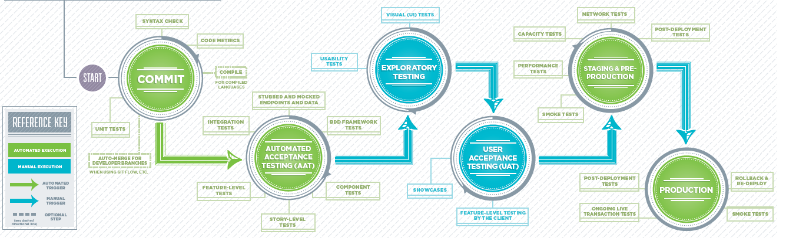

# Azure WAF Reliability Automated Testing Practice (with Azure Proactive Resiliency Library)

## Summary

Integrate Microsoft Well Architected Framework Reliability best practices for Azure Services (Service Guides) within the application or platform service lifecycle and make it repeatable by integrating it in the service's DevOps CI/CD Pipeline.

## Infrastructure Azure WAF Reliability Automated Testing - Definition

This automated testing approach leverages PowerShell module based [Azure Proactive Resiliency Library](https://azure.github.io/Azure-Proactive-Resiliency-Library-v2/tools/) to generate WAF recommendations compliance report for deployed Azure resources.

Recommended Pipeline Stage: Pre-Production
Recommended Pipeline Explanation: 
- The pre-production environment is closest to Production environment from Azure resource setup perspective (e.g. Dev env may not have resourced deployed with Azure Availability Zones). 
- Depending on number of deployed resources, the assessment (testing) may also take longer which make it more suitable for stages not requiring fast feedback. 
 
Testing steps (process):
- Deploy target Azure infrastructure/platform services (to test environment)
- Run APRL (Reseliency Library) PowerShell Collector cmdlet to generate assessment report (JSON output)
- Fail the Stage in case assessment fails to meet minimum threshold (e.g. Threshold for Mission Critical is 0% for all recommendations have to be implemented, Threshold for Supporting Applications is 0% for critical recommendations only) 

## Tools

- [Azure Proactive Resiliency Library](https://azure.github.io/Azure-Proactive-Resiliency-Library-v2/tools/)

## DevOps (CI/CD) Pipeline Definition

Recommended Pipeline stages:
- Commit (Build)
- Automated Acceptance Testing - AAT
- Exploratory Testing
- User Acceptance Testing - UAT
- Pre-Production (Staging)
- Production

Recommended practices per pipeline stage:

| Practice / Task                      | Stage  | Automated | (Example) Tools      |
| ------------------------------------ | ------ | --------- | -------------------- |
| (Automated) Unit Testing             | Commit | Yes       | Nunit, MSUnit, JUnit |
| Code Compile                         | Commit |           |                      |
| Static Code Quality Analysis         | Commit | Yes       | SonarQube            |
| Integration (Automated) Tests        | AAT    | Yes       |                      |
| Component (Automated) Tests          | AAT    | Yes       |                      |
| Functional (Feature) Automated Tests | AAT    | Yes       |                      |
